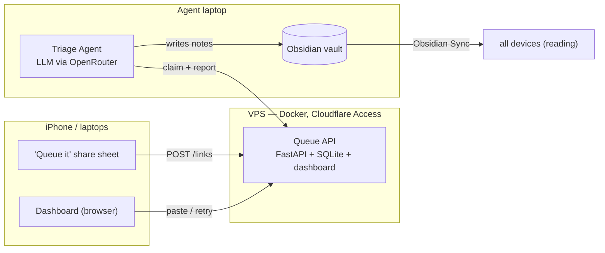

# obsidian-linkqueue

**A self-hosted capture queue + LLM triage pipeline for an Obsidian knowledge base.**

Share a link from any device in one tap → it lands in a server-side Queue → a periodic LLM Agent files it into the Obsidian vault as a properly classified note → Obsidian Sync propagates it everywhere. The vault stays what it's good at: reading. The queue stops being a markdown file fought over by three devices.



## Documentation

| Doc | What's in it |
|---|---|
| [docs/ARCHITECTURE.md](docs/ARCHITECTURE.md) | Full design: components, API surface, data model, triage flow, deployment, vault migration plan |
| [CONTEXT.md](CONTEXT.md) | Domain glossary — what Link, Capture, Queue, Triage, Agent, Vault mean here |
| [docs/adr/0001](docs/adr/0001-obsidian-sync-sole-vault-sync.md) | Why Obsidian Sync is the only vault sync, and why the Agent runs on a laptop, not the VPS |
| [docs/adr/0002](docs/adr/0002-queue-lives-outside-the-vault.md) | Why the queue lives outside the vault (the core move that kills sync conflicts) |
| [docs/adr/0003](docs/adr/0003-vault-must-not-live-in-icloud-synced-folders.md) | Why the vault can't live under an iCloud-synced folder |
| [docs/NEXT-STEPS.md](docs/NEXT-STEPS.md) | Manual setup checklist: Obsidian Sync pairing, Cloudflare Zero Trust, Coolify deploy, iOS Shortcut |

## Status

- ✅ **Queue API** — capture, dedup, atomic claim-with-lease, outcomes, dashboard.
- ✅ **Triage Agent** — `agent/` package, Pydantic AI over OpenRouter, guarded index rewrites (ADR 0004), launchd schedule.
- 🔜 **Vault backup job** — nightly one-way git push.

## Quickstart

Requires [uv](https://docs.astral.sh/uv/).

```bash
uv venv --seed -p 3.12       # once
uv sync --group dev          # once
source .venv/bin/activate
python -m pytest tests/ -q   # run the suite
QUEUE_AUTH_MODE=disabled QUEUE_DB=queue.db \
  uvicorn app.main:create_app --factory --reload
```

Dashboard at `http://localhost:8000/`.

## API

| Endpoint | Purpose |
|---|---|
| `POST /links` | Capture `{url, note?, source?}`. 201 on create, 200 with the existing link when the normalized URL is already queued. |
| `GET /links?status=` | List links, optionally filtered by `pending / processing / done / failed`. |
| `POST /links/claim` | `{limit?, lease_seconds?}` — atomically claim pending (or lease-expired) links as `processing`. |
| `PATCH /links/{id}` | Report outcome: `{status: done\|failed\|pending, note_path?, error?}`. `pending` = retry, clears error. |
| `DELETE /links/{id}` | Remove a link. |

## Deploy

Build from the `Dockerfile` (e.g. via Coolify). Attach a persistent volume at `/data` — SQLite lives at `/data/queue.db`.

| Env var | Value |
|---|---|
| `QUEUE_DB` | `/data/queue.db` (image default) |
| `QUEUE_AUTH_MODE` | `cloudflare` (default) or `disabled` (local dev only) |
| `CF_TEAM_DOMAIN` | e.g. `yourteam.cloudflareaccess.com` |
| `CF_POLICY_AUD` | the Cloudflare Access application's Audience (AUD) tag |

Put the domain behind a Cloudflare Access application: humans log in via SSO; the iOS Shortcut and the Agent authenticate with an Access **service token** (`CF-Access-Client-Id` / `CF-Access-Client-Secret` headers). The app additionally verifies the `Cf-Access-Jwt-Assertion` JWT at the origin.

## iOS Shortcut ("Queue it")

Share sheet → receives URLs → *Get Contents of URL*:

- Method `POST`, URL `https://<your-domain>/links`
- Headers: `CF-Access-Client-Id`, `CF-Access-Client-Secret`, `Content-Type: application/json`
- Body: `{"url": <Shortcut input>, "source": "iphone"}`

## Triage Agent

Runs on the laptop where the Vault lives (`obs_triage run`, plus a nightly
launchd job at 22:00). Claims pending Links, pre-fetches each URL, makes two
structured LLM calls per Link (classify + index rewrite) over OpenRouter,
writes one note per Link into the Vault, and reports `done`/`failed` back to
the Queue. Index rewrites are guarded — see `docs/adr/0004`.

### Install globally

`uv tool install` puts `obs_triage` on your PATH (`~/.local/bin`), isolated
from any project venv:

```bash
# from a local checkout (use -e to pick up edits without reinstalling)
uv tool install --editable /path/to/obsidian-linkqueue

# or straight from GitHub, no checkout needed
uv tool install git+https://github.com/palsagar/obsidian-linkqueue
```

Upgrade later with `uv tool upgrade linkqueue`; remove with
`uv tool uninstall linkqueue`.

### Configure

Config lives in `~/.config/linkqueue/agent.env` (chmod 600):

```bash
OPENROUTER_API_KEY=sk-or-...
QUEUE_URL=https://queue.<your-domain>
CF_ACCESS_CLIENT_ID=<service-token-id>.access
CF_ACCESS_CLIENT_SECRET=<service-token-secret>
VAULT_PATH=~/Obsidian/vault
# optional overrides
#TRIAGE_MODEL=x-ai/grok-4.5
#TRIAGE_FALLBACK_MODEL=deepseek/deepseek-v4-pro
#TRIAGE_LIMIT=20
```

### Schedule

Install the nightly job (the plist points at `~/.local/bin/obs_triage`;
adjust the username inside if needed):

```bash
cp deploy/com.linkqueue.triage.plist ~/Library/LaunchAgents/
launchctl load ~/Library/LaunchAgents/com.linkqueue.triage.plist
```

Manual run anytime: `obs_triage run` (add `--limit N` to cap a run).
Offline or empty queue → the run skips silently.
