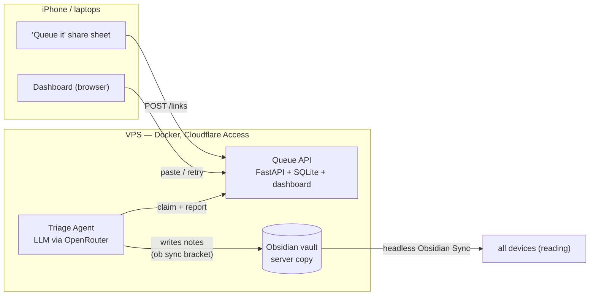

# obsidian-linkqueue

**A self-hosted capture queue + LLM triage pipeline for an Obsidian knowledge base.**

Share a link from any device in one tap → it lands in a server-side Queue → a periodic LLM Agent files it into the Obsidian vault as a properly classified note → Obsidian Sync propagates it everywhere. The vault stays what it's good at: reading. The queue stops being a markdown file fought over by three devices.



## Documentation

| Doc | What's in it |
|---|---|
| [docs/ARCHITECTURE.md](docs/ARCHITECTURE.md) | Full design: components, API surface, data model, triage flow, deployment, vault migration plan |
| [CONTEXT.md](CONTEXT.md) | Domain glossary — what Link, Capture, Queue, Triage, Agent, Vault mean here |
| [docs/adr/0001](docs/adr/0001-obsidian-sync-sole-vault-sync.md) | Why Obsidian Sync is the only vault sync (superseded by 0005 on where the Agent runs) |
| [docs/adr/0002](docs/adr/0002-queue-lives-outside-the-vault.md) | Why the queue lives outside the vault (the core move that kills sync conflicts) |
| [docs/adr/0003](docs/adr/0003-vault-must-not-live-in-icloud-synced-folders.md) | Why the vault can't live under an iCloud-synced folder |
| [docs/adr/0004](docs/adr/0004-guarded-full-index-rewrite.md) | Why index rewrites are guarded by wikilink preservation |
| [docs/adr/0005](docs/adr/0005-agent-moves-to-vps-with-headless-sync.md) | Why the Agent runs on the VPS with a one-shot headless-sync bracket per run |
| [docs/NEXT-STEPS.md](docs/NEXT-STEPS.md) | Manual cutover checklist: retire laptop jobs, deploy + bootstrap the triage container |

## Status

- ✅ **Queue API** — capture, dedup, atomic claim-with-lease, outcomes, run heartbeat, dashboard.
- ✅ **Triage Agent** — `agent/` package, Pydantic AI over OpenRouter, guarded index rewrites (ADR 0004), server-side via `Dockerfile.triage` + headless Obsidian Sync (ADR 0005).
- ✅ **Vault backup job** — nightly one-way git push from the triage container.

## Quickstart

Requires [uv](https://docs.astral.sh/uv/).

```bash
uv venv --seed -p 3.12       # once
uv sync --group dev          # once
source .venv/bin/activate
python -m pytest tests/ -q   # run the suite
QUEUE_AUTH_MODE=disabled QUEUE_DB=queue.db \
  uvicorn app.main:create_app --factory --reload
```

Dashboard at `http://localhost:8000/`.

## API

| Endpoint | Purpose |
|---|---|
| `POST /links` | Capture `{url, note?, source?}`. 201 on create, 200 with the existing link when the normalized URL is already queued. |
| `GET /links?status=` | List links, optionally filtered by `pending / processing / done / failed`. |
| `POST /links/claim` | `{limit?, lease_seconds?}` — atomically claim pending (or lease-expired) links as `processing`. |
| `PATCH /links/{id}` | Report outcome: `{status: done\|failed\|pending, note_path?, error?}`. `pending` = retry, clears error. |
| `DELETE /links/{id}` | Remove a link. |
| `POST /runs` | Agent heartbeat: `{started_at, finished_at, outcome, done?, failed?, error?}` — one row per triage run, latest shown on the dashboard. |

## Deploy

Two containers (e.g. via Coolify), each with its own persistent volume at `/data`.

**Queue** — build from `Dockerfile`; SQLite lives at `/data/queue.db`.

| Env var | Value |
|---|---|
| `QUEUE_DB` | `/data/queue.db` (image default) |
| `QUEUE_AUTH_MODE` | `cloudflare` (default) or `disabled` (local dev only) |
| `CF_TEAM_DOMAIN` | e.g. `yourteam.cloudflareaccess.com` |
| `CF_POLICY_AUD` | the Cloudflare Access application's Audience (AUD) tag |

**Triage** — build from `Dockerfile.triage`; the vault, `ob` auth state, ssh key and git identity live under `/data` (the container's `HOME`). Scheduled by supercronic (`deploy/triage.crontab`): triage hourly 9:00–19:00 weekdays + midnight daily, backup at 00:30 (`TZ=Europe/Paris`). One-time bootstrap via `docker exec`: see [docs/NEXT-STEPS.md](docs/NEXT-STEPS.md).

| Env var | Value |
|---|---|
| `OPENROUTER_API_KEY` | OpenRouter key for the triage LLM |
| `QUEUE_URL` | `https://queue.<your-domain>` |
| `CF_ACCESS_CLIENT_ID` / `CF_ACCESS_CLIENT_SECRET` | Cloudflare Access service token |
| `VAULT_PATH` | `/data/vault` (image default) |
| `TRIAGE_MODEL` / `TRIAGE_FALLBACK_MODEL` / `TRIAGE_LIMIT` | optional overrides |

Put the domain behind a Cloudflare Access application: humans log in via SSO; the iOS Shortcut and the Agent authenticate with an Access **service token** (`CF-Access-Client-Id` / `CF-Access-Client-Secret` headers). The app additionally verifies the `Cf-Access-Jwt-Assertion` JWT at the origin.

## iOS Shortcut ("Queue it")

Share sheet → receives URLs → *Get Contents of URL*:

- Method `POST`, URL `https://<your-domain>/links`
- Headers: `CF-Access-Client-Id`, `CF-Access-Client-Secret`, `Content-Type: application/json`
- Body: `{"url": <Shortcut input>, "source": "iphone"}`

## Triage Agent

Runs on the VPS in the triage container (`obs_triage run --sync`, scheduled
by supercronic; ADR 0005). Each run pulls the latest vault state via one-shot
`ob sync` (a failed pull aborts the run — Links just wait), claims pending
Links, pre-fetches each URL, makes two structured LLM calls per Link
(classify + index rewrite) over OpenRouter, writes one note per Link into
the Vault, reports `done`/`failed` back to the Queue, pushes via `ob sync`,
and POSTs a run heartbeat. Index rewrites are guarded — see `docs/adr/0004`.

The same run also triages **Clippings**: full pages staged in the Vault's
`Clippings/` folder (e.g. Obsidian Web Clipper output) are classified, moved
into their Taxonomy folder under a clean title with merged frontmatter
(content untouched), and indexed. Failed clippings stay in place for the
next run.

### Install globally

`uv tool install` puts `obs_triage` on your PATH (`~/.local/bin`), isolated
from any project venv:

```bash
# from a local checkout (use -e to pick up edits without reinstalling)
uv tool install --editable /path/to/obsidian-linkqueue

# or straight from GitHub, no checkout needed
uv tool install git+https://github.com/palsagar/obsidian-linkqueue
```

Upgrade later with `uv tool upgrade linkqueue`; remove with
`uv tool uninstall linkqueue`.

### Configure

In the container, config comes from env vars (see Deploy above). For a local
run, an env-format file at `~/.config/linkqueue/agent.env` (chmod 600) takes
precedence when it exists:

```bash
OPENROUTER_API_KEY=sk-or-...
QUEUE_URL=https://queue.<your-domain>
CF_ACCESS_CLIENT_ID=<service-token-id>.access
CF_ACCESS_CLIENT_SECRET=<service-token-secret>
VAULT_PATH=~/Obsidian/vault
# optional overrides
#TRIAGE_MODEL=x-ai/grok-4.5
#TRIAGE_FALLBACK_MODEL=deepseek/deepseek-v4-pro
#TRIAGE_LIMIT=20
```

Manual run anytime: `obs_triage run` (add `--limit N` to cap a run, `--sync`
to bracket with `ob sync`). Offline or empty queue → the run skips silently.

## Vault backup

`obs_triage backup` does a one-way `git add / commit / push` of the Vault to
its `origin` remote — it never fetches or pulls (git is a backup target, not
a sync mechanism). No changes → no commit. A diverged remote makes the push
fail loudly rather than merge. Runs nightly at 00:30 in the triage container,
pushed from the vault copy the Agent writes to (ADR 0005).
