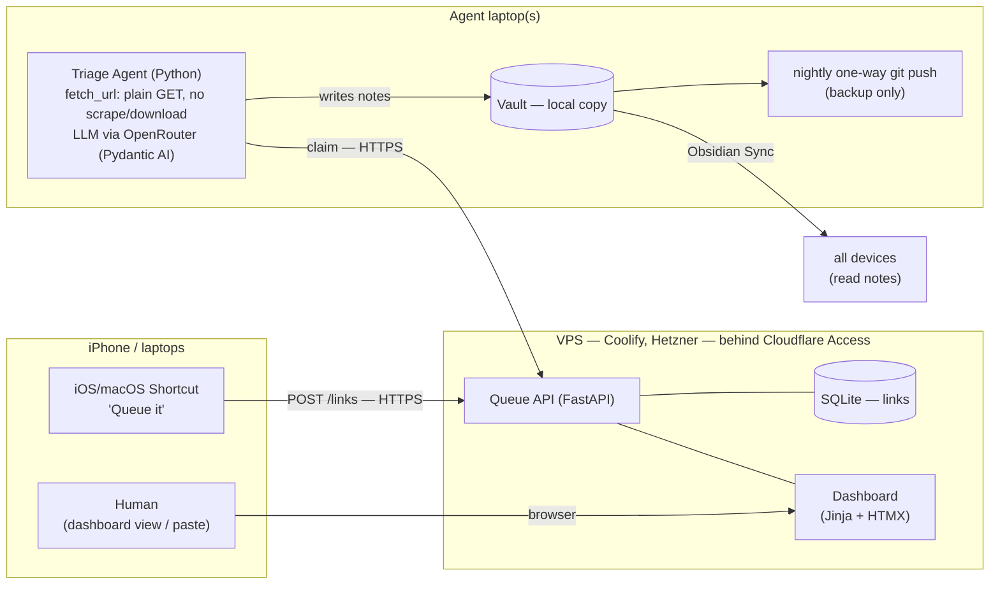
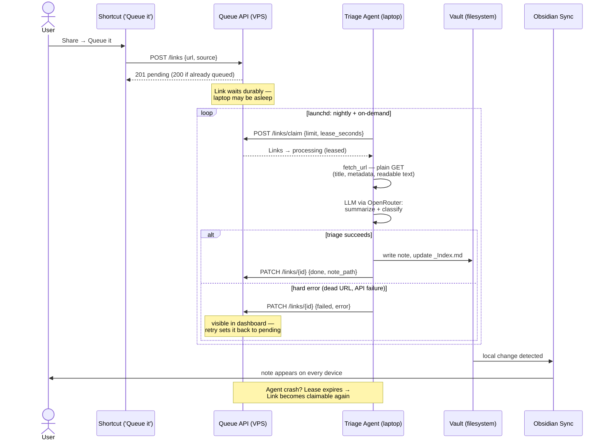

# Architecture — Link Capture & Triage

Terms per [CONTEXT.md](../CONTEXT.md). Decisions per [ADR 0001](adr/0001-obsidian-sync-sole-vault-sync.md) (Obsidian Sync is the sole vault sync; Agent runs on a laptop) and [ADR 0002](adr/0002-queue-lives-outside-the-vault.md) (Queue lives on the VPS, outside the Vault).

## Overview

Flow: Capture appends a Link to the Queue → Triage (periodic, on a laptop) claims pending Links, takes a brief look at each (plain GET, no scraping or downloads), writes one note per Link into the Vault and updates `_Index.md` files → Obsidian Sync propagates to all devices.

## Flow sequence

## Components

### 1. Queue API — FastAPI on the VPS

Single small service, Docker image deployed via Coolify, SQLite file on a persistent volume.

Endpoints (JSON):

| Endpoint | Purpose |
|---|---|
| `POST /links` | Capture. Body: `url`, optional `note`, optional `source` (device). Dedups on normalized URL (returns the existing Link instead of a duplicate). |
| `GET /links?status=` | List Links (Agent polling + dashboard). |
| `POST /links/claim` | Atomically claim up to N `pending` Links → `processing` with a lease expiry (`UPDATE … WHERE status='pending' RETURNING`). Expired leases revert to `pending`, so a crashed run self-heals and two laptops never double-process. |
| `PATCH /links/{id}` | Agent reports outcome: `done` (+ `note_path`, the vault-relative path of the created note) or `failed` (+ error). Dashboard uses it for retry (`failed → pending`) and delete. |

`links` table: `id`, `url`, `url_normalized` (unique), `note`, `source`, `status` (`pending|processing|done|failed`), `lease_expires_at`, `note_path`, `error`, `created_at`, `updated_at`.

### 2. Dashboard — served by the same FastAPI app

Jinja + HTMX, no build step. Lists Links by status, paste-a-link form (desktop capture fallback), retry/delete on failures, and per-Link outcome (which note it became). This is also the debugging window into Triage.

### 3. Auth — Cloudflare Access

- Domain proxied through Cloudflare; Access application in front of it.
- Humans: SSO (email OTP / Google) for the dashboard.
- Machines (Shortcut, Agent): Access **service tokens** via `CF-Access-Client-Id`/`CF-Access-Client-Secret` headers.
- FastAPI middleware verifies the Cloudflare-signed `Cf-Access-Jwt-Assertion` JWT so the origin rejects traffic that didn't pass Access (covers direct-to-IP hits).

### 4. Capture clients

- **iOS/macOS Shortcut** ("Queue it"): share-sheet target; grabs the shared URL, POSTs to `/links` with service-token headers. One tap after Share. Same Shortcut syncs to the Macs via iCloud.
- **Dashboard form**: paste fallback on any browser.
- Anything else later (bookmarklet, Raycast, CLI) is just another caller of `POST /links`.

### 5. Triage Agent — Python worker on the laptop(s)

Runs where the Vault is (ADR 0001). Installed on this Mac first; the second laptop can be added later unchanged thanks to claim semantics.

- **Layout**: `agent/` package in this repo, next to `app/`; console script `triage` (subcommand `run`).
- **Trigger**: launchd, nightly at 22:00 + on-demand (`triage run`). Skips silently if offline or no pending Links.
- **No deterministic fetch pipeline** (no trafilatura/yt-dlp/X-syndication). Python **pre-fetches** each claimed Link — one plain HTTP GET returning page title, OG/meta description, and readable text when the page serves it — then makes a single structured LLM call per Link. Articles and blog posts usually serve their content this way and get a real summary. X and YouTube links are deliberately **not** scraped or downloaded — the model sees the URL plus whatever metadata the page exposes, writes a tiny summary (grounded in that metadata, not full content), and sorts the Link accordingly.
- **Judgment (LLM via OpenRouter)**: Pydantic AI (OpenRouter provider). Default model `x-ai/grok-4.5`, availability-fallback `deepseek/deepseek-v4-pro` (fallback fires on API errors, never on content); both configurable. Given the fetched context + the Taxonomy (the folders listed in the root Index Note — strays on disk are invisible) and the target folder's Index Note, it returns structured data only — note body, folder, tags, and the rewritten Index Note. It may propose a new Taxonomy folder when nothing fits (prompt biases strongly toward existing folders).
- **All file writes are Python's**: the note, the folder's `_Index.md`, and — for a new folder — the folder, its `_Index.md`, and the root Index Note entry. Index rewrites are guarded: any rewrite that drops a pre-existing wikilink is rejected and falls back to a plain append under the model's chosen section (ADR 0004).
- **Note format**: frontmatter with `source` (URL), `captured`/`triaged` dates, `tags`, `triaged: true` — so recent arrivals are queryable from within Obsidian (Bases/Dataview) for post-hoc review (auto-write policy).
- **Clippings**: the same run also triages full pages staged in the Vault's `Clippings` folder (Obsidian Web Clipper output). No fetching or summarizing — the content already exists. The model classifies (folder, clean title, tags, section); Python moves the file into the folder under the new title, merges frontmatter (adds `triaged` + topical tags, keeps `source`/`created`), and updates the Index Note via the same guarded rewrite. Failures leave the file in place for the next run.
- **Reporting**: PATCHes each Link `done`/`failed` (with `note_path`/`error`). Only hard errors (URL dead, model/API failure) mark a Link `failed`; thin metadata does not. `failed` is terminal for the Agent — retry is the human's dashboard button. No Triage Log note.
- **Config**: `~/.config/linkqueue/agent.env` (chmod 600, outside repo/Vault/iCloud), loaded explicitly by the CLI so interactive and launchd runs share it: `OPENROUTER_API_KEY`, `TRIAGE_MODEL`, `TRIAGE_FALLBACK_MODEL`, `QUEUE_URL`, `CF_ACCESS_CLIENT_ID`, `CF_ACCESS_CLIENT_SECRET`, `VAULT_PATH`.

### 6. Backup job — one-way git push

`obs_triage backup` (same CLI/config as Triage), nightly launchd at 23:00 on the Agent laptop: `git add -A && git commit && git push` to the private GitHub repo. Never pulls, never runs on other devices; a diverged remote fails the push loudly instead of merging. Pure offsite history.

## Migration plan (one-time cleanup)

Order matters; do this before building anything that touches the Vault.

1. **Snapshot both vaults** (zip or Time Machine checkpoint) — everything below becomes reversible.
2. **Settle vault 1's git**: resolve the open merge conflict in `Processing Queue - Links dump.md` (keep both link lists), commit everything including untracked notes, push. This is the "final state" backup of the git era.
3. **Reconcile the two vault copies**: diff `Obsidian Vault` vs `sagar's vault`; copy anything unique in vault 2 into vault 1. (They're near-identical; expect a handful of files.)
4. **Make vault 1 the one Vault**: first move it out of iCloud's reach — `~/Documents` is synced by "Desktop & Documents in iCloud" ([ADR 0003](adr/0003-vault-must-not-live-in-icloud-synced-folders.md)) — to `~/Obsidian/vault`, and open it from there in Obsidian. Then connect it to Obsidian Sync — overwrite/replace the remote vault. Remove the obsidian-git plugin. Delete the `.obsidian-git-bridge/` folders and `conflict-files-obsidian-git*.md` artifacts.
5. **Reconnect iPhone + second laptop** to the remote vault fresh (delete their local copies first to avoid re-merging stale state).
6. **Archive `sagar's vault`** (move out of `~/Documents`, keep the snapshot) once sync is verified on all three devices.
7. **Drain the old queue page**: the links still in `Processing Queue - Links dump.md` become the first `POST /links` batch; then delete the page (ADR 0002).

## Build order

1. Queue API + SQLite + auth middleware, deployed on Coolify behind Cloudflare Access. *(Capture works via curl from day one.)*
2. iOS Shortcut. *(The iPhone friction — 80% of the problem — is now solved, before any LLM work.)*
3. Dashboard.
4. Triage Agent: `fetch_url` tool → note-writing agent → launchd schedule.
5. Backup job + vault migration finalization.
